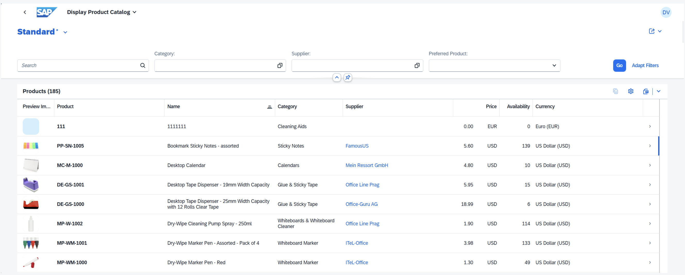
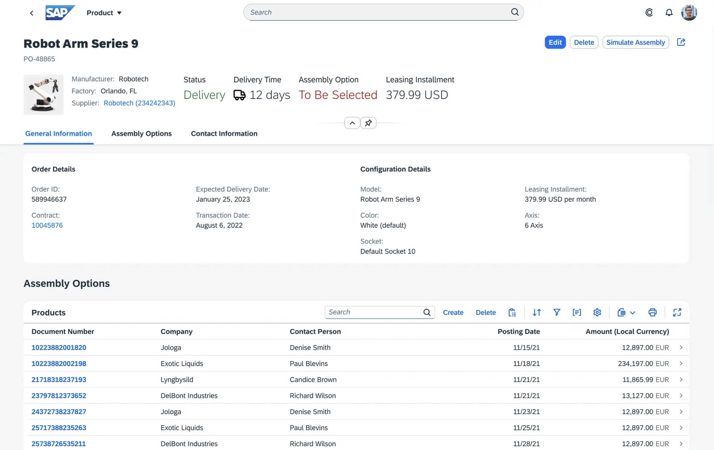
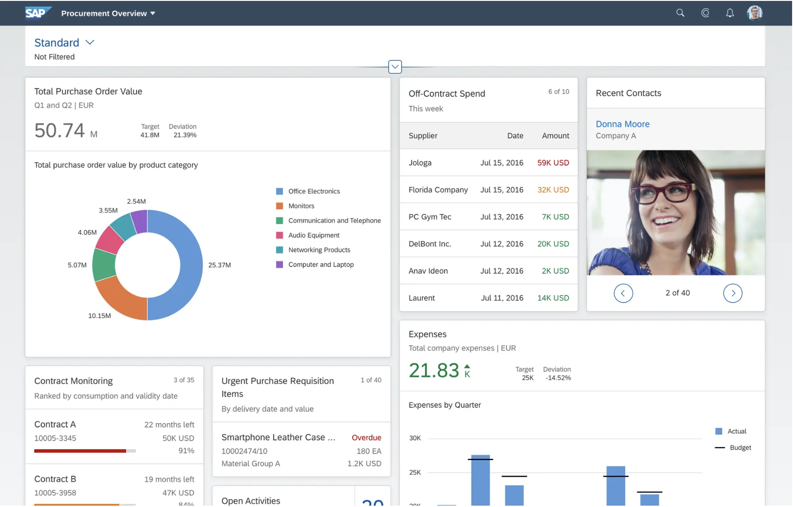
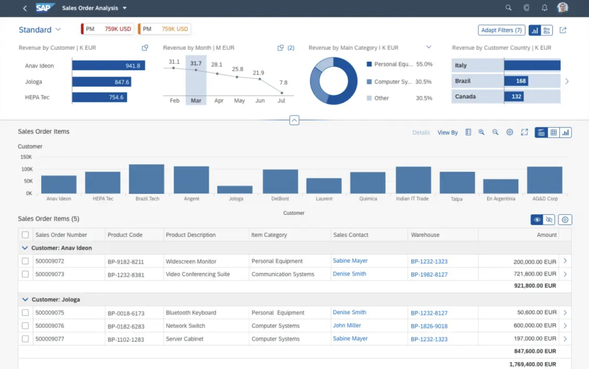
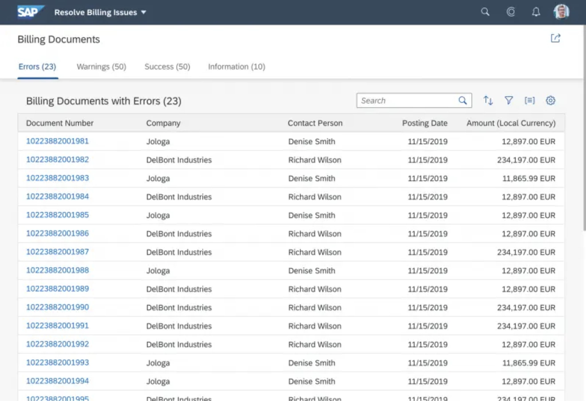

# 3.1 - Templates in Fiori Elements

## 3.1.1 - List Report
:::tip
Die List-Report-Page ist eine der meistgenutzten Templates aus Fiori Elements. Sie wird meist als Standpunkt für Fiori Apps benutzt.
:::

## 3.1.2 - Object Page
:::tip
Die Object-Page geht meistens in einem einher mit der List-View. Sie soll aufgerufen werden, wenn man ein Element der List-Report-Page auswählt.
:::

## 3.1.3 - Overview Page

## 3.1.4 - Analytical Page

## 3.1.5 - Work Page
